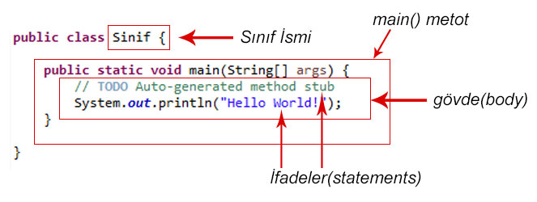

<h1 align="center">Java Notes </h1>

<p align="center">
  
</p>

## **Java Tarihçesi**

1991 yılında Sun Microsystems şirketi mühendislerinden James Gosling ve 12 arkadaşı Green Project(Yeşil Proje) isimli bir proje geliştirmeye başladılar. Gömülü Sistemler üzerine çalışan James Gosling ve ekibi başlangıçta C ve C++ dillerini kullansalar da bu dillerin geliştirdikleri projeye uygun bir dil olmadığını ve geliştirdikleri proje için yetersiz olduğunu görüp yeni bir arayış içine girdiler ve bu sırada “Oak” şimdiki adıyla Java dili doğmuş oldu.

Java, doğrudan C++ ile bağlantılıdır. C++ ise C’nin devamıdır. Java, karakteristik özelliklerinin birçoğunu bu iki dilden almıştır. C’nin sözdizimi (syntax), C++’ın ise nesne yönelimli programlama (object oriented programming- OOP) kavramları Java’ya miras kalmıştır. Bunun yanı sıra, Java, bu dillerdeki karmaşıklığı ortadan kaldırmış, eksik özelliklerini ise tamamlamıştır.

## **Java'nın Avantajları Nelerdir ?**

### **_Basit Olması_**

Java’nın yazımı kolaydır. daha okunaklı bir yapısı vardır ve dikkat çekicidir. Java geleceğe dönük olarak oluşturulacak yapılarla kullanımı kolaylaştırılır, sadeleştirilir ve öğrenmesi kolaydır.

---

### **_Tarafsız Mimariye Sahip_**

Java özel makinelere ya da işletim sistemi mimarilerine bağlı değildir. Java donanımdan bağımsızdır. Java'yı platform bağımsız kılan özelliği yazılan kaynak kodlar derlendikten sonra ara bir dil olan byte code'a çevrilmesidir. Ara dile çevrilen bu kod parçaları Java Virtual Machine vasıtasıyla yorumlanır ve çalıştırılır. Buradaki tek sorun hız sorunudur. Çünkü işletim sistemiyle birlikte Virtual Machine’de bilgisayarın kaynaklarını kullandığı için daha yavaş çalışmaktadır.

---

### **_Nesne Yönelimli Olması_**

Java da C++ gibi nesne yönelimlinin özelliklerinden faydalanır. Sınıflar oluşturularak daha az kod yazıp daha fazla iş yaparak kod tekrarı önlenmiş olur. Böylece geliştirme sürecinin verimliliği artar.

---

### **_Zengin Kütüphane Desteği_**

Java çok zengin ve geniş bir kütüphaneye sahiptir ve ücretsiz olarak erişim sağlayıp temin edilebilir. Bu sayede bir çok platformda uygulama geliştirme imkanı sağlar.

---

### **_Multi-Thread & Dinamik_**

'Multi-Thread' bir programda bir çok işlemin aynı zamanda gerçekleşmesi özelliğidir. Eş zamanlı işlemleri programlayabilmenize imkan tanır. Java bu tür program geliştirmeye destekler.

---

## **Java ile Uygulama Geliştirme Yapabileceğiniz Alanlar**

Teknoloji ve onları geliştirmek için kullanılan diller sürekli bir evrim geçirmekte. Java dili, çok sayıda uygulamaya sahip popüler programlama dillerinden biridir. Java ile ne tür uygulanalar yapılabilir ?

- Mobil Uygulamalar : Java, mobil uygulama geliştirme için çok kullanılan bir programlama dilidir. Android Studio ve Kotlin gibi yazılımlarla uyumludur. Çünkü Android İşletim Sistemi Java ile yazılmıştır. Android'in sınıf dosyalarını yürütmek için DVK (Dalvik Virtual Machine) kullanırken Java Virtual Machine (JVM) üzerinde çalışmaktadır. Java ve OOP ilkeleri ile Android ile daha iyi güvenlik ve basitlik sağlar.

- Masaüstü Uygulamalar : Masaüstü uygulamaları Java ile kolaylıkla geliştirilebilir. Java ayrıca AWT, Swing ve JavaFX gibi eklentileri ile arayüz geliştirme desteği ve kolaylığı sağlar.

- Web Tabanlı Uygulamalar : Java, web uygulamaları geliştirmek için de kullanılır. Servlets, Struts veya JSP eklentileri ile web uygulamaları için geniş destek sağlar. Bu teknolojiler sayesinde ihtiyacınız olan her türlü web uygulamasını geliştirebilirsiniz.

- Kurumsal Uygulamalar : Java en çok talep gören programlama dillerden biridir. Büyük ve küçük işletmeler, bu dilde yazılmış uygulamalarla desteklenmektedir. Bu, yenilikçi bir ticari yazılım türü fikriniz varsa, Java muhtemelen sizin için en iyi dildir demektir. Havayollarının, devlet kurumlarının her gün kullandığı özel işletme yazılımlarının çoğu için de geçerlidir.
- Bilimsel Uygulamalar : Bilimsel hesaplamalar ve matematiksel işlemler yaptırmak için Java çok kullanılan bir dildir. MATLAB gibi en popüler uygulamalardan bazıları, GUI (Arayüz) ve çekirdek yapılarında Java kullanır.

- Oyun Programlama : Java, bağımsız oyun geliştirme şirketleri tarafından ve mobil oyunlar oluşturmak için yaygın olarak kullanılmaktadır. Java, 3 boyutlu oyunların tasarımı söz konusu olduğunda benzersiz bir yeteneğe sahip olan açık kaynaklı 3D Motor olan jMonkeyEngine'in desteğine sahiptir. Dünyanın en iyi mobil oyunlarının çoğu Java'da geliştirilmiştir. Minecraft, Mission Impossible III ve Asphalt 6 vb.

- Gömülü sistem uygulamaları geliştirebilirsiniz. (Java2ME Embedded altyapısı ile) Java, gömülü sistem tasarımcıları için bir dizi avantaja sahiptir. Java, dil olarak, C ++ tehlikeleri olmadan nesne yönelimli programlamaya izin verir. Örneğin, Java sınıf kalıtımına izin verir, ancak birden çok ebeveynden gelmez, bu nedenle kafa karışıklığı fırsatı yoktur. Ayrıca Java, teknoloji geliştiricilerinin değişen pazar koşullarına hızla yanıt vermesini mümkün kılar. Uygun şekilde uygulanırsa, gömülü bir uygulamanın Java bölümleri uygulamanın geri kalanından izole edilebilir, böylece görev açısından kritik bölümleri Java bölümlerinin yol açtığı bozulmaya karşı korur.

## **Yazım Kuralları**

- Türkçe Karakter Kullanımı : Java ve bir çok programlama dili Türkçe karakter desteklememektedir. Programda ki metin ifadeleri dışında Türkçe karakter kullanılmamalıdır. Türkçe Karakterler : ç, ı, ü, ğ, ö, ş, İ, Ğ, Ü, Ö, Ş, Ç

- Harf Duyarlılığı : Java harfe duyarlı bir dildir. Kelimelerdeki küçük ve büyük harfler farklı olarak algılanır. Java’da Kodluyoruz ile kodluyoruz farklı anlama gelmektedir.
- Sınıf Adları : Java’da sınıf adlarının ilk harfi büyük olmalıdır. Eğer 2 kelimeyi birleştirerek bir sınıf adı oluşturursak bu isimlerin baş harfleri büyük olmalıdır. Örnek: CamelCase

- Metot Adları : Metot adları küçük harfle başlar. Metot adı verilirken iki kelime birleştirilecekse ismin başlangıç harfi küçük diğer birleştirilen kelimelerin başlangıç harfleri büyük yazılır. Örnek: camelCaseOrnek

## **İsimlendirme Kuralları**

### Medium üzerinde bulunan bir makale;

[Yazılımda İsimlendirme](https://ibrahim-kurce.medium.com/yaz%C4%B1l%C4%B1mda-i%CC%87simlendirme-7fcc3d3d6965)

## **Java üzerinde isimlendirme Kuralları**

- Java'da isimlendirilen tüm ögeler sadece A-Z veya a-z gibi harfler, $ karakteri veya \_ karakteri ile başlayabilirler.
- Keyword’ler (Yasaklı Kelimeler) isimlendirmede kullanılamaz
  
- Sınıflar için upper camel case kullanılır. HelloWorld
- Metotlar için lower camel case kullanılır. helloWorld
- Değişkenler için lower camel case kullanılır. helloWorld
- Sabitler için screaming snake case kullanılır. HELLO_WORLD

## Main Metodu ve Kullanımı

Java'da bir program çalışacağı zaman, kodlar ilk olarak main metodu içerisinden başlar. Main metodu sayesinde derleyiciye, programı buradan başlatılması konusunda referans oluşturulur.

```java
 public class JavaPatika {
   public static void main(String[] args) {
       System.out.println("Hello World!");
   }
 }
```

Artık programı çalıştırdığımızda, derleyici ilk olarak main metodu okuyup sonrasında gerekli işlemleri yapacaktır.

Main metodu yazılırken, args yerine başka bir isimlendirme yapılabilir. Ancak genellikle args sözcüğü kullanılır ve bu sözcük arguments sözcüğünün kısaltmasıdır. Arguments ile ifade edilen kısım, sınıf çalıştırılırken JVM tarafından bu sınıfa verilen parametrelerdir.

## Genel Sözdizimi (**Syntax**)

#


